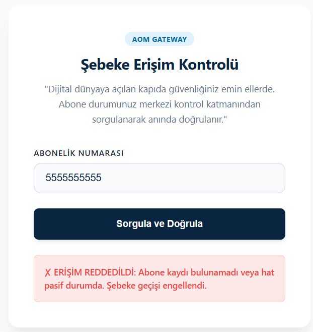

Bu proje, yüksek trafikli telekomünikasyon altyapılarında abone hatlarının aktiflik durumlarını mikrosaniyeler mertebesinde sorgulamak için tasarlanmış bir **Core Network Gateway (AOM1)** simülasyonudur. Sistem, disk tabanlı geleneksel veri tabanlarının yavaşlığını aşmak amacıyla verileri tamamen RAM üzerinde distributed (dağıtık) olarak tutan **Hazelcast** mimarisini kullanır.

