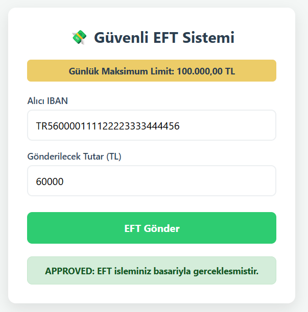
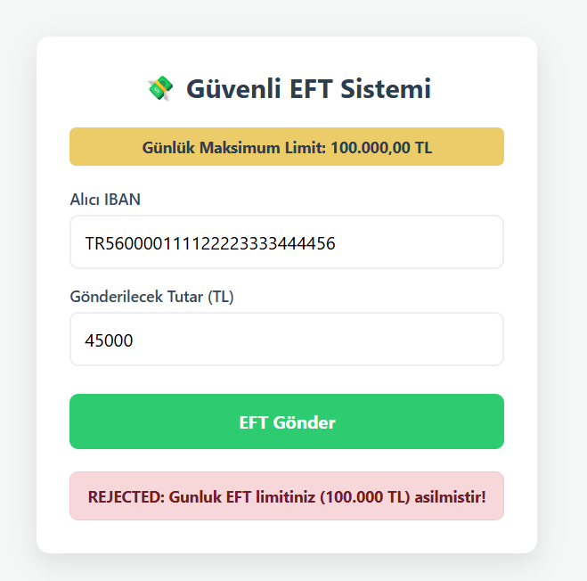

Bu proje, bankacılık işlemlerinde kullanıcıların günlük transfer limitlerini ilişkisel veri tabanlarına yük bindirmeden, RAM üzerinde anlık olarak denetleyen mini bir mikroservis simülasyonudur.

## Çalışma Mantığı

1 Kullanıcı arayüzden IBAN ve Tutar girip gönderir.

2 Spring Boot, gelen IBAN'ın o gün yaptığı harcamayı Hazelcast RAM havuzundan çeker.

3 Yeni tutar eskisinin üzerine eklenir ve 100.000 TL günlük limit ile kıyaslanır:

    Limit aşılmadıysa: İşlem onaylanır (APPROVED) ve yeni toplam tutar RAM'e kaydedilir.

     Limit aşılırsa: İşlem reddedilir (REJECTED) ve hafıza güncellenmez.

Aynı IBAN üzerinden ilk istekte 60.000 TL gönderilmiştir. Tutar, günlük maksimum limit olan 100.000 TL sınırının altında kaldığı için işlem backend tarafından başarıyla onaylanmış (APPROVED) ve güncel bakiye Hazelcast RAM hafızasına işlenmiştir.

aynı IBAN ile 45.000 TL tutarında ikinci bir transfer denemesi yapılmıştır. Hazelcast RAM'deki eski harcama (60.000 TL) ile yeni tutar toplandığında toplam harcama 105.000 TL'ye ulaşmıştır. Günlük üst sınır aşıldığı için sistem anında bloke koyarak işlemi reddetmiştir (REJECTED).